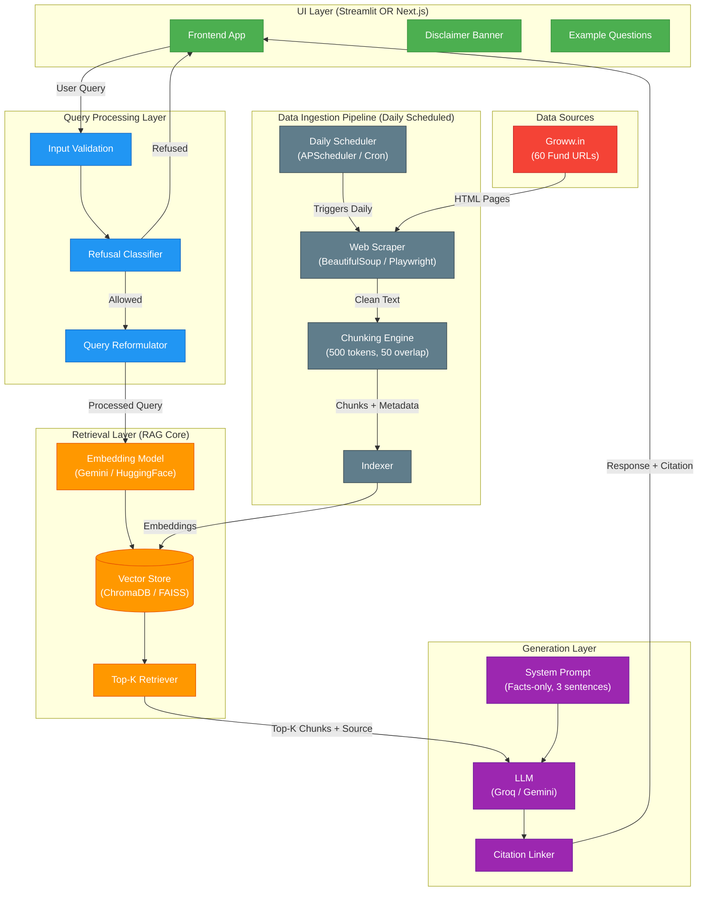
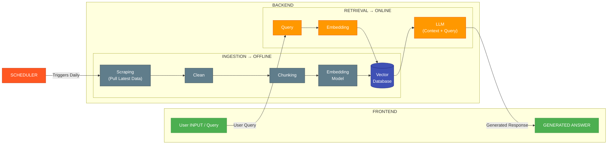

# Architecture Document: Mutual Fund FAQ Assistant

## 1. System Overview

A lightweight **Retrieval-Augmented Generation (RAG)** chatbot that answers facts-only queries about mutual fund schemes listed on Groww. The system ingests data from 60 official mutual fund URLs, builds a searchable vector index, and generates concise, source-backed responses using an LLM.

```
┌─────────────────────────────────────────────────────────────────────┐
│                         USER INTERFACE                               │
│  (Streamlit OR Next.js frontend with disclaimer & example questions) │
└────────────────────────────────────┬────────────────────────────────┘
                                     │ User Query
                                     ▼
┌─────────────────────────────────────────────────────────────────────┐
│                      QUERY PROCESSING LAYER                         │
│  ┌────────────┐  ┌──────────────────┐  ┌────────────────────────┐  │
│  │ Input      │  │ Refusal          │  │ Query                  │  │
│  │ Validation │→ │ Classification   │→ │ Reformulation          │  │
│  └────────────┘  └──────────────────┘  └────────────────────────┘  │
└────────────────────────────────────┬────────────────────────────────┘
                                     │ Validated Query
                                     ▼
┌─────────────────────────────────────────────────────────────────────┐
│                      RETRIEVAL LAYER (RAG)                           │
│  ┌────────────────────┐  ┌───────────────────────────────────────┐  │
│  │ Embedding Model    │  │ Vector Store (ChromaDB / FAISS)       │  │
│  │ (Gemini / HF)      │→ │ 60 fund pages indexed as chunks      │  │
│  └────────────────────┘  └───────────────────────────────────────┘  │
└────────────────────────────────────┬────────────────────────────────┘
                                     │ Top-K Relevant Chunks + Source URL
                                     ▼
┌─────────────────────────────────────────────────────────────────────┐
│                      GENERATION LAYER                                │
│  ┌────────────────────┐  ┌───────────────────────────────────────┐  │
│  │ LLM (Groq /        │  │ System Prompt:                        │  │
│  │ Gemini / Both)      │  │ - Max 3 sentences                    │  │
│  │                     │  │ - 1 citation link                    │  │
│  └────────────────────┘  │ - "Last updated from sources: <date>" │  │
│                           │ - No advice, no opinions              │  │
│                           └───────────────────────────────────────┘  │
└────────────────────────────────────┬────────────────────────────────┘
                                     │ Formatted Response
                                     ▼
┌─────────────────────────────────────────────────────────────────────┐
│                      RESPONSE LAYER                                  │
│  ┌────────────────┐  ┌──────────────────┐  ┌────────────────────┐  │
│  │ Response       │  │ Citation         │  │ Disclaimer         │  │
│  │ Formatting     │→ │ Attachment       │→ │ Footer             │  │
│  └────────────────┘  └──────────────────┘  └────────────────────┘  │
└─────────────────────────────────────────────────────────────────────┘
```

### High-Level Architecture Diagram (Mermaid)



### Simplified System Architecture (Backend + Frontend)




**Key Insight from the diagram:**
- **Ingestion (Offline):** Scheduler triggers daily scraping → cleaning → chunking → embedding → stored in vector database. This runs independently of user queries.
- **Retrieval (Online):** When a user asks a question, it gets embedded → matched against the vector database → relevant context is sent to the LLM along with the query → answer is generated and returned to the frontend.
- **The vector database is the bridge** between the offline ingestion pipeline and the online retrieval pipeline.

---

## 2. Component Details

### 2.1 Data Ingestion Pipeline

**Purpose:** Scrape, parse, and chunk content from 60 Groww mutual fund URLs.

**Trigger:** A **daily scheduler** (cron / APScheduler / Celery Beat) triggers the ingestion pipeline automatically.

```
┌──────────────┐    ┌──────────────┐    ┌──────────────┐    ┌──────────────┐    ┌──────────────┐
│  Scheduler   │ →  │  URL List    │ →  │  Web Scraper │ →  │  Content     │ →  │  Vector      │
│  (Daily Cron)│    │  (60 URLs)   │    │  (BS4/       │    │  Chunker     │    │  Store       │
│              │    │              │    │   Playwright)│    │  (Recursive) │    │  (ChromaDB)  │
└──────────────┘    └──────────────┘    └──────────────┘    └──────────────┘    └──────────────┘
```

**Steps:**
1. Fetch HTML from each of the 60 fund URLs
2. Extract structured data: NAV, expense ratio, exit load, min SIP, fund manager details, benchmark, riskometer, holdings
3. Clean and normalize text (remove ads, navigation, disclaimers noise)
4. Chunk into overlapping segments (chunk size: ~500 tokens, overlap: ~100 tokens)
5. Generate embeddings and store in vector database with metadata (source URL, fund name, category, last scraped date)

**Metadata per chunk:**
```json
{
  "source_url": "https://groww.in/mutual-funds/...",
  "fund_name": "HDFC Mid Cap Fund Direct Growth",
  "category": "Mid Cap",
  "section": "exit_load | expense_ratio | fund_manager | holdings | ...",
  "last_scraped": "2026-06-03"
}
```

---

### 2.2 Query Processing Layer

| Component | Responsibility |
|-----------|---------------|
| **Input Validation** | Reject PII (PAN, Aadhaar, phone, email, OTP), enforce max query length |
| **Refusal Classifier** | Detect advisory/opinion queries using keyword + LLM classification |
| **Query Reformulation** | Normalize fund names, expand abbreviations (SIP, ELSS, NAV, AUM) |

**Refusal Logic:**
```python
ADVISORY_PATTERNS = [
    "should I invest", "which fund is better", "recommend",
    "best fund to buy", "will it give returns", "compare performance"
]
# If matched → return polite refusal + AMFI/SEBI educational link
```

**PII Detection:**
```python
PII_PATTERNS = [
    r"\b[A-Z]{5}\d{4}[A-Z]\b",       # PAN
    r"\b\d{12}\b",                     # Aadhaar
    r"\b\d{6,}\b",                     # Account numbers
    r"\b\d{4,6}\b",                    # OTP
    r"[\w.-]+@[\w.-]+\.\w+",          # Email
    r"\b[6-9]\d{9}\b"                 # Phone
]
# If detected → refuse to process, inform user
```

---

### 2.3 Retrieval Layer

**Vector Store:** ChromaDB (lightweight, local) or FAISS (for scale)

**Embedding Model:** `models/text-embedding-004` (Gemini) or `all-MiniLM-L6-v2` (HuggingFace open-source)

**Retrieval Strategy:**
- Semantic similarity search (cosine distance)
- Top-K = 5 chunks retrieved per query
- Re-ranking with metadata filters (fund name, category)
- Source URL extracted from top chunk metadata

---

### 2.4 Generation Layer

**LLM Options:**

| Provider | Model | Notes |
|----------|-------|-------|
| **Groq** | `llama-3.3-70b-versatile` / `gemma2-9b-it` | Ultra-fast inference, free tier available |
| **Gemini** | `gemini-2.0-flash` / `gemini-1.5-pro` | Generous free quota, multimodal capable |
| **Both** | Groq (primary) + Gemini (fallback) | Redundancy + cost optimization |

**System Prompt:**
```
You are a facts-only mutual fund FAQ assistant. You MUST:
1. Answer in maximum 3 sentences
2. Include exactly ONE citation link from the provided context
3. End every response with: "Last updated from sources: <date>"
4. NEVER provide investment advice, opinions, or recommendations
5. NEVER compare fund performance or calculate returns
6. For performance queries, only provide a link to the official factsheet
7. If the query is advisory, refuse politely and provide an AMFI/SEBI link

You can answer questions about:
- Expense ratio, exit load, minimum SIP amount
- ELSS lock-in period, riskometer classification, benchmark index
- Fund manager name, qualification, and experience
- NAV, AUM, fund house details
- Process to download statements or capital gains reports
```

---

### 2.5 User Interface

**Framework Options:**

| Option | Stack | When to Choose |
|--------|-------|----------------|
| **Option A** | Streamlit (Python) | Rapid prototyping, single-language stack, fastest MVP |
| **Option B** | Next.js (React/TypeScript) | Production-grade UI, better UX control, custom styling, SSR/ISR |

> **Note:** If Next.js is chosen, the Python backend should expose a **FastAPI** REST/WebSocket API that the Next.js frontend consumes.

**UI Components (both options):**
- Welcome message with disclaimer banner
- 3 example clickable questions
- Chat input box (streaming response support)
- Response area with citation link and footer
- Persistent disclaimer: *"Facts-only. No investment advice."*

---

## 3. Data Corpus — 60 Fund URLs

### Large Cap Funds (15)

| # | Fund Name | Source URL |
|---|-----------|-----------|
| 1 | Nippon India Large Cap Fund Direct Growth | https://groww.in/mutual-funds/nippon-india-large-cap-fund-direct-growth |
| 2 | UTI Nifty 50 Index Fund Direct Growth | https://groww.in/mutual-funds/uti-nifty-fund-direct-growth |
| 3 | ICICI Prudential Large Cap Fund Direct Growth | https://groww.in/mutual-funds/icici-prudential-large-cap-fund-direct-growth |
| 4 | ICICI Prudential BHARAT 22 FOF Direct Growth | https://groww.in/mutual-funds/icici-prudential-bharat-22-fof-direct-growth |
| 5 | UTI Nifty Next 50 Index Fund Direct Growth | https://groww.in/mutual-funds/uti-nifty-next-50-index-fund-direct-growth |
| 6 | HDFC NIFTY 50 Index Fund Direct Growth | https://groww.in/mutual-funds/hdfc-nifty-50-index-fund-direct-growth |
| 7 | SBI Nifty Next 50 Index Fund Direct Growth | https://groww.in/mutual-funds/sbi-nifty-next-50-index-fund-direct-growth |
| 8 | ICICI Prudential Nifty Next 50 Index Direct Growth | https://groww.in/mutual-funds/icici-prudential-nifty-next-50-index-fund-direct-growth |
| 9 | Navi Nifty 50 Index Fund Direct Growth | https://groww.in/mutual-funds/navi-nifty-50-index-fund-direct-growth |
| 10 | SBI Large Cap Direct Plan Growth | https://groww.in/mutual-funds/sbi-large-cap-direct-plan-growth |
| 11 | ICICI Prudential Nifty 50 Index Direct Plan Growth | https://groww.in/mutual-funds/icici-prudential-nifty-index-fund-direct-growth |
| 12 | Parag Parikh Large Cap Fund Direct Growth | https://groww.in/mutual-funds/parag-parikh-large-cap-fund-direct-growth |
| 13 | HDFC BSE Sensex Index Fund Direct Growth | https://groww.in/mutual-funds/hdfc-bse-sensex-index-fund-direct-growth |
| 14 | DSP Nifty Next 50 Index Fund Direct Growth | https://groww.in/mutual-funds/dsp-nifty-next-50-index-fund-direct-growth |
| 15 | JioBlackRock Nifty 50 Index Fund Direct Growth | https://groww.in/mutual-funds/jioblackrock-nifty-50-index-fund-direct-growth |

### Mid Cap Funds (15)

| # | Fund Name | Source URL |
|---|-----------|-----------|
| 16 | HDFC Mid Cap Fund Direct Growth | https://groww.in/mutual-funds/hdfc-mid-cap-fund-direct-growth |
| 17 | Motilal Oswal Midcap Fund Direct Growth | https://groww.in/mutual-funds/motilal-oswal-most-focused-midcap-30-fund-direct-growth |
| 18 | Nippon India Growth Mid Cap Fund Direct Growth | https://groww.in/mutual-funds/nippon-india-growth-mid-cap-fund-direct-growth |
| 19 | WhiteOak Capital Mid Cap Fund Direct Growth | https://groww.in/mutual-funds/whiteoak-capital-mid-cap-fund-direct-growth |
| 20 | Edelweiss Mid Cap Direct Plan Growth | https://groww.in/mutual-funds/edelweiss-mid-and-small-cap-fund-direct-growth |
| 21 | Invesco India Mid Cap Fund Direct Growth | https://groww.in/mutual-funds/invesco-india-mid-cap-fund-direct-growth |
| 22 | Kotak Midcap Fund Direct Growth | https://groww.in/mutual-funds/kotak-emerging-equity-scheme-direct-growth |
| 23 | Motilal Oswal Nifty Midcap 150 Index Fund Direct Growth | https://groww.in/mutual-funds/motilal-oswal-nifty-midcap-150-index-fund-direct-growth |
| 24 | Quant Mid Cap Fund Direct Growth | https://groww.in/mutual-funds/quant-mid-cap-fund-direct-growth |
| 25 | SBI Mid Cap Direct Plan Growth | https://groww.in/mutual-funds/sbi-mid-cap-direct-plan-growth |
| 26 | Axis Midcap Direct Plan Growth | https://groww.in/mutual-funds/axis-midcap-fund-direct-growth |
| 27 | HSBC Midcap Fund Direct Growth | https://groww.in/mutual-funds/hsbc-midcap-fund-direct-growth |
| 28 | Nippon India Nifty Midcap 150 Index Fund Direct Growth | https://groww.in/mutual-funds/nippon-india-nifty-midcap-150-index-fund-direct-growth |
| 29 | ICICI Prudential Midcap Direct Plan Growth | https://groww.in/mutual-funds/icici-prudential-midcap-fund-direct-growth |
| 30 | JioBlackRock Nifty Midcap 150 Index Fund Direct Growth | https://groww.in/mutual-funds/jioblackrock-nifty-midcap-150-index-fund-direct-growth |

### Small Cap Funds (13)

| # | Fund Name | Source URL |
|---|-----------|-----------|
| 31 | Bandhan Small Cap Fund Direct Growth | https://groww.in/mutual-funds/bandhan-small-cap-fund-direct-growth |
| 32 | Nippon India Small Cap Fund Direct Growth | https://groww.in/mutual-funds/nippon-india-small-cap-fund-direct-growth |
| 33 | Quant Small Cap Fund Direct Plan Growth | https://groww.in/mutual-funds/quant-small-cap-fund-direct-plan-growth |
| 34 | Tata Small Cap Fund Direct Growth | https://groww.in/mutual-funds/tata-small-cap-fund-direct-growth |
| 35 | Axis Small Cap Fund Direct Growth | https://groww.in/mutual-funds/axis-small-cap-fund-direct-growth |
| 36 | Invesco India Smallcap Fund Direct Growth | https://groww.in/mutual-funds/invesco-india-smallcap-fund-direct-growth |
| 37 | SBI Small Cap Fund Direct Growth | https://groww.in/mutual-funds/sbi-small-midcap-fund-direct-growth |
| 38 | HDFC Small Cap Fund Direct Growth | https://groww.in/mutual-funds/hdfc-small-cap-fund-direct-growth |
| 39 | Motilal Oswal Small Cap Fund Direct Growth | https://groww.in/mutual-funds/motilal-oswal-small-cap-fund-direct-growth |
| 40 | Canara Robeco Small Cap Fund Direct Growth | https://groww.in/mutual-funds/canara-robeco-small-cap-fund-direct-growth |
| 41 | Bank of India Small Cap Fund Direct Growth | https://groww.in/mutual-funds/bank-of-india-small-cap-fund-direct-growth |
| 42 | Nippon India Nifty Smallcap 250 Index Fund Direct Growth | https://groww.in/mutual-funds/nippon-india-nifty-smallcap-250-index-fund-direct-growth |
| 43 | Mirae Asset Small Cap Fund Direct Growth | https://groww.in/mutual-funds/mirae-asset-small-cap-fund-direct-growth |

### Flexi Cap / Focused Funds (7)

| # | Fund Name | Source URL |
|---|-----------|-----------|
| 44 | Parag Parikh Flexi Cap Fund Direct Growth | https://groww.in/mutual-funds/parag-parikh-long-term-value-fund-direct-growth |
| 45 | HDFC Flexi Cap Direct Plan Growth | https://groww.in/mutual-funds/hdfc-equity-fund-direct-growth |
| 46 | Quant Flexi Cap Fund Direct Growth | https://groww.in/mutual-funds/quant-flexi-cap-fund-direct-growth |
| 47 | ICICI Prudential Flexicap Fund Direct Growth | https://groww.in/mutual-funds/icici-prudential-flexicap-fund-direct-growth |
| 48 | Motilal Oswal Flexi Cap Fund Direct Growth | https://groww.in/mutual-funds/motilal-oswal-most-focused-multicap-35-fund-direct-growth |
| 49 | HDFC Focused Fund Direct Growth | https://groww.in/mutual-funds/hdfc-focused-fund-direct-growth |
| 50 | SBI Focused Fund Direct Plan Growth | https://groww.in/mutual-funds/sbi-focused-fund-direct-plan-growth |

### Defence Funds (5)

| # | Fund Name | Source URL |
|---|-----------|-----------|
| 51 | HDFC Defence Fund Direct Growth | https://groww.in/mutual-funds/hdfc-defence-fund-direct-growth |
| 52 | Motilal Oswal Nifty India Defence Index Fund Direct Growth | https://groww.in/mutual-funds/motilal-oswal-nifty-india-defence-index-fund-direct-growth |
| 53 | ICICI Prudential Infrastructure Direct Growth | https://groww.in/mutual-funds/icici-prudential-infrastructure-fund-direct-growth |
| 54 | Nippon India Power & Infra Fund Direct Growth | https://groww.in/mutual-funds/nippon-india-power-infra-fund-direct-growth |
| 55 | Franklin Build India Fund Direct Growth | https://groww.in/mutual-funds/franklin-build-india-fund-direct-growth |

### Equity / Thematic Funds (5)

| # | Fund Name | Source URL |
|---|-----------|-----------|
| 56 | SBI PSU Direct Plan Growth | https://groww.in/mutual-funds/sbi-psu-fund-direct-growth |
| 57 | Aditya Birla Sun Life PSU Equity Fund Direct Growth | https://groww.in/mutual-funds/aditya-birla-sun-life-psu-equity-fund-direct-growth |
| 58 | Motilal Oswal Large and Midcap Fund Direct Growth | https://groww.in/mutual-funds/motilal-oswal-large-and-midcap-fund-direct-growth |
| 59 | Edelweiss US Technology Equity FoF Direct Growth | https://groww.in/mutual-funds/edelweiss-us-technology-equity-fof-direct-growth |
| 60 | Motilal Oswal BSE Enhanced Value Index Fund Direct Growth | https://groww.in/mutual-funds/motilal-oswal-bse-enhanced-value-index-fund-direct-growth |

---

## 4. Tech Stack

| Layer | Technology | Justification |
|-------|-----------|---------------|
| **Frontend** | Streamlit **OR** Next.js (React + TypeScript) | Streamlit for fast MVP; Next.js for production-grade UI, SSR, and custom design |
| **Backend** | Python (FastAPI) | Required API layer if using Next.js; also compatible with Streamlit |
| **API Layer** | FastAPI + WebSocket (optional) | REST endpoints for Next.js; streaming via WebSocket/SSE |
| **Web Scraping** | BeautifulSoup + Requests / Playwright | Handle static and dynamic content |
| **Chunking** | LangChain RecursiveCharacterTextSplitter | Overlapping chunks for context preservation |
| **Embeddings** | Gemini `text-embedding-004` or `all-MiniLM-L6-v2` (HF) | Free/low-cost, good semantic quality |
| **Vector Store** | ChromaDB (dev) / FAISS (prod) | Lightweight, no infra overhead |
| **LLM** | Groq (`llama-3.3-70b`) **and/or** Gemini (`gemini-2.0-flash`) | Groq = fastest inference; Gemini = generous free tier |
| **Orchestration** | LangChain | RAG pipeline, prompt templates, chain management |
| **Scheduler** | APScheduler / Celery Beat / cron | Daily trigger for ingestion pipeline; lightweight, no external infra |
| **Environment** | Python 3.11+, pip/poetry | Standard ML/AI stack |

---

## 5. Data Flow — End to End

```
[User types query]
        │
        ▼
[Input Validation] ──── PII detected? ──── YES ──→ [Refuse: "Cannot process personal data"]
        │
        NO
        ▼
[Refusal Classifier] ── Advisory query? ── YES ──→ [Polite refusal + AMFI/SEBI link]
        │
        NO
        ▼
[Query Embedding] ──→ [Vector Search in ChromaDB]
        │
        ▼
[Top-5 Chunks Retrieved with source URLs]
        │
        ▼
[LLM Generation with System Prompt + Context]
        │
        ▼
[Response: ≤3 sentences + 1 citation + footer]
        │
        ▼
[Display to User]
```

---

## 6. Data Extraction Schema

For each of the 60 fund pages, the scraper extracts:

| Field | Example | Source Section |
|-------|---------|---------------|
| Fund Name | HDFC Defence Fund Direct Growth | Page title |
| NAV | ₹28.44 | Header section |
| AUM | ₹9,123.61 Cr | Header section |
| Expense Ratio | 0.83% | Header / Details |
| Exit Load | 1% if redeemed within 1 year | Exit load section |
| Min SIP | ₹100 | Minimum investments |
| Min Lumpsum | ₹100 | Minimum investments |
| Risk Level | Very High | Risk tag |
| Category | Equity - Thematic | Category tag |
| Benchmark | Nifty India Defence Total Return Index | About section |
| Fund Manager(s) | Name, qualification, experience, tenure | Fund management section |
| Holdings | Top 10 stocks with allocation % | Holdings section |
| Investment Objective | Scheme's stated objective | About section |
| Fund House | AMC name, address, contact | Fund house section |
| Launch Date | Date scheme was available | About section |
| Rating | Value Research star rating | Header |

---

## 7. Chunking Strategy

```python
from langchain.text_splitter import RecursiveCharacterTextSplitter

splitter = RecursiveCharacterTextSplitter(
    chunk_size=500,          # ~500 tokens per chunk
    chunk_overlap=100,       # 100 token overlap for context
    separators=["\n\n", "\n", ". ", " "],
    length_function=len
)
```

**Estimated corpus size:**
- 60 URLs × ~2,000 tokens avg per page = ~120,000 tokens raw
- After chunking: ~300–400 chunks in vector store

---

## 8. Prompt Engineering

### Main Answer Prompt

```
SYSTEM:
You are a facts-only mutual fund FAQ assistant for Indian mutual funds listed on Groww.

RULES:
1. Answer ONLY from the provided context. Do not hallucinate.
2. Maximum 3 sentences per response.
3. Include exactly 1 source URL from the context.
4. End with: "Last updated from sources: {last_scraped_date}"
5. NEVER give investment advice, recommendations, or opinions.
6. NEVER compare funds or calculate/predict returns.
7. For return/performance queries, say: "For performance data, please visit: {source_url}"
8. You CAN answer about: expense ratio, exit load, min SIP, benchmark, riskometer,
   fund manager details (name, qualification, experience), holdings, NAV, AUM.

CONTEXT:
{retrieved_chunks}

USER QUERY:
{user_query}
```

### Refusal Prompt

```
I can only provide factual information about mutual fund schemes such as expense ratio,
exit load, minimum SIP amount, fund manager details, and benchmark index.
I cannot provide investment advice or recommendations.

For investment guidance, please visit: https://www.amfiindia.com/investor-corner/knowledge-center/what-are-mutual-funds.html

"Last updated from sources: {date}"
```

---

## 9. Guardrails & Compliance

| Guardrail | Implementation |
|-----------|---------------|
| No PII processing | Regex-based detection before query enters pipeline |
| No advisory content | Keyword classifier + LLM secondary check |
| Source attribution | Every response includes exactly 1 Groww URL |
| Date transparency | Footer with last corpus scrape date |
| Content boundary | System prompt strictly limits LLM to context-only answers |
| Max response length | Hard limit of 3 sentences enforced in prompt |
| No third-party sources | Only Groww URLs in corpus; no blogs or aggregators |

---

## 10. Deployment Architecture

```
┌──────────────────────────────────────────────────────┐
│                    DEPLOYMENT                          │
│                                                       │
│  Option A (Streamlit):                                │
│  ┌──────────────┐    ┌──────────────┐                │
│  │  Streamlit   │    │  ChromaDB    │                │
│  │  App Server  │◄──►│  (Persistent │                │
│  │  (Port 8501) │    │   Storage)   │                │
│  └──────────────┘    └──────────────┘                │
│         │                                             │
│         ▼                                             │
│  ┌──────────────┐    ┌──────────────┐                │
│  │  LangChain   │───►│  Groq/Gemini │                │
│  │  RAG Chain   │    │  API (LLM)   │                │
│  └──────────────┘    └──────────────┘                │
│                                                       │
│  Option B (Next.js):                                  │
│  ┌──────────────┐    ┌──────────────┐                │
│  │  Next.js     │    │  FastAPI     │                │
│  │  Frontend    │◄──►│  Backend     │                │
│  │  (Port 3000) │    │  (Port 8000) │                │
│  └──────────────┘    └──────────────┘                │
│         │                    │                        │
│         │              ┌─────┴──────┐                 │
│         │              │  ChromaDB  │                 │
│         │              └─────┬──────┘                 │
│         │                    ▼                        │
│         │           ┌──────────────┐                  │
│         └──────────►│ Groq/Gemini  │                  │
│                     │    API       │                  │
│                     └──────────────┘                  │
│                                                       │
│  Environment: Docker / Local venv + Node              │
│  CI/CD: GitHub Actions (optional)                     │
└──────────────────────────────────────────────────────┘
```

**Deployment Options:**

| | Streamlit | Next.js |
|---|-----------|----------|
| **Local Dev** | `streamlit run app.py` | `npm run dev` + `uvicorn api:app` |
| **Docker** | Single container | Multi-container (docker-compose) |
| **Cloud** | Streamlit Cloud / Railway / Render | Vercel (frontend) + Railway/Render (FastAPI) |

---

## 11. Directory Structure

```
RAG-Chatbot-Financial-Platform/
├── Docs/
│   ├── problemStatement.md
│   ├── problemStatement.txt
│   ├── architecture.md
│   └── groww-mf-urls.md
├── backend/                        # Python backend (used by both options)
│   ├── __init__.py
│   ├── app.py                      # Streamlit UI (Option A)
│   ├── api.py                      # FastAPI server (Option B)
│   ├── config.py                   # API keys, settings
│   ├── ingestion/
│   │   ├── __init__.py
│   │   ├── scraper.py              # Web scraping logic
│   │   ├── parser.py               # HTML → structured data
│   │   └── chunker.py              # Text splitting
│   ├── retrieval/
│   │   ├── __init__.py
│   │   ├── embeddings.py           # Embedding generation
│   │   ├── vectorstore.py          # ChromaDB operations
│   │   └── retriever.py            # Similarity search
│   ├── generation/
│   │   ├── __init__.py
│   │   ├── prompts.py              # System/user prompt templates
│   │   ├── llm.py                  # LLM call wrapper
│   │   └── chain.py                # LangChain RAG chain
│   └── guardrails/
│   │   ├── __init__.py
│   │   ├── pii_detector.py         # PII regex patterns
│   │   ├── refusal.py              # Advisory query classifier
│   │   └── validator.py            # Response validation
│   └── scheduler/
│       ├── __init__.py
│       └── daily_ingest.py         # APScheduler / cron trigger for ingestion
├── frontend/                       # Next.js frontend (Option B)
│   ├── package.json
│   ├── next.config.js
│   ├── tsconfig.json
│   ├── tailwind.config.ts
│   ├── src/
│   │   ├── app/
│   │   │   ├── layout.tsx          # Root layout + disclaimer
│   │   │   ├── page.tsx            # Chat page
│   │   │   └── globals.css
│   │   ├── components/
│   │   │   ├── ChatInput.tsx
│   │   │   ├── ChatMessage.tsx
│   │   │   ├── ExampleQuestions.tsx
│   │   │   └── Disclaimer.tsx
│   │   └── lib/
│   │       └── api.ts              # FastAPI client helper
│   └── public/
├── data/
│   ├── raw/                        # Scraped HTML/text
│   ├── processed/                  # Cleaned chunks
│   └── vectordb/                   # ChromaDB persistent storage
├── tests/
│   ├── test_scraper.py
│   ├── test_guardrails.py
│   ├── test_retrieval.py
│   └── test_generation.py
├── .env.example                    # API key template
├── requirements.txt                # Python dependencies
├── docker-compose.yml              # Multi-service (for Option B)
├── Dockerfile                      # Python backend container
└── README.md
```

---

## 12. Sample Interactions

### Factual Query (Success)

**User:** "What is the expense ratio of HDFC Defence Fund?"

**Assistant:** "The expense ratio of HDFC Defence Fund Direct Growth is 0.83% as of June 2026. Source: https://groww.in/mutual-funds/hdfc-defence-fund-direct-growth

Last updated from sources: 2026-06-03"

---

### Fund Manager Query (Success)

**User:** "Who manages the Motilal Oswal Nifty India Defence Index Fund?"

**Assistant:** "Motilal Oswal Nifty India Defence Index Fund is managed by Swapnil P Mayekar (M.Com, Mumbai University; Advanced Diploma in Business Administration from Welingkar) since June 2024, along with co-managers Rakesh Shetty and Dishant Mehta. Source: https://groww.in/mutual-funds/motilal-oswal-nifty-india-defence-index-fund-direct-growth

Last updated from sources: 2026-06-03"

---

### Advisory Query (Refusal)

**User:** "Should I invest in HDFC Mid Cap Fund?"

**Assistant:** "I can only provide factual information about mutual fund schemes such as expense ratio, exit load, minimum SIP amount, fund manager details, and benchmark index. I cannot provide investment advice or recommendations. For investment guidance, please visit: https://www.amfiindia.com/investor-corner/knowledge-center/what-are-mutual-funds.html

Last updated from sources: 2026-06-03"

---

### PII Query (Refusal)

**User:** "My PAN is ABCDE1234F, check my investments"

**Assistant:** "I cannot process personal information such as PAN numbers, Aadhaar, account numbers, or contact details. I can only answer factual questions about mutual fund schemes. Please contact your fund house or broker directly for account-related queries.

Last updated from sources: 2026-06-03"

---

## 13. Refresh Strategy

**The ingestion pipeline is triggered by a daily scheduler** that runs automatically (default: 2:00 AM IST). This ensures NAV, AUM, and other fund data stay up-to-date.

| Task | Frequency | Method |
|------|-----------|--------|
| Re-scrape all 60 URLs | **Daily** | Scheduler (APScheduler / Celery Beat / system cron) |
| Re-generate embeddings | After every scrape | Automated — part of daily pipeline |
| Update `last_scraped` metadata | Every scrape | Stored in vector DB metadata |
| Diff detection (optional) | Daily | Only re-embed chunks that changed (optimization) |
| Add new fund URLs | As needed (manual) | Update `groww-mf-urls.md` + re-run pipeline |

**Scheduler Options:**

| Option | Best For | Notes |
|--------|----------|-------|
| **APScheduler** (Python) | Single-process deployment | Runs inside the app process; zero infra |
| **Celery Beat** + Redis | Production multi-worker | Distributed task queue; retry/backoff support |
| **System cron** | Docker / VM deployments | `0 2 * * * python -m backend.ingestion.run_pipeline` |
| **GitHub Actions** (scheduled) | Serverless / no-server | `.github/workflows/daily-ingest.yml` with cron trigger |

---

## 14. Known Limitations

1. **Data freshness:** NAV and AUM values change daily; corpus updates daily via scheduler (intra-day changes not captured)
2. **Scope:** Limited to 60 funds; not comprehensive across all 5000+ funds on Groww
3. **Dynamic content:** Some Groww pages use client-side rendering; may need Playwright
4. **No real-time data:** Cannot provide live NAV or market data
5. **Single source:** Only Groww as data source; no cross-validation with AMC websites
6. **Language:** English only
7. **No account-level queries:** Cannot access user portfolios, transactions, or statements

---

## 15. Success Metrics

| Metric | Target |
|--------|--------|
| Factual accuracy | > 95% correct answers (verified against source) |
| Citation accuracy | 100% responses include valid source URL |
| Refusal rate (advisory) | > 98% advisory queries correctly refused |
| PII blocking | 100% PII queries blocked |
| Response length | ≤ 3 sentences per response |
| Response latency | < 3 seconds per query |
| User satisfaction | Qualitative testing with 5+ sample users |
