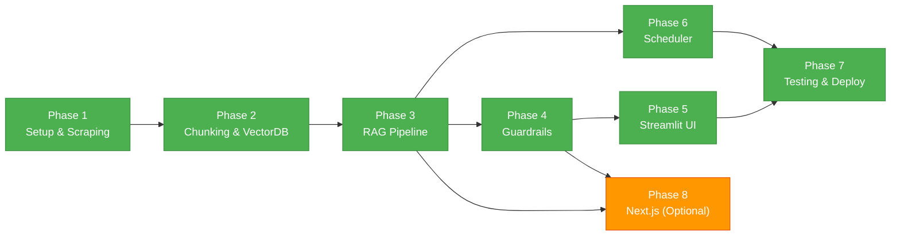

# Phase-Wise Implementation Plan

## RAG-Based Mutual Fund FAQ Assistant

---

## Timeline Overview

| Phase | Focus | Duration | Deliverable |
|-------|-------|----------|-------------|
| **Phase 1** | Project Setup & Data Ingestion | Days 1–3 | Scraper + parsed data in `data/raw/` |
| **Phase 2** | Chunking & Vector Store | Days 4–5 | Searchable vector index (ChromaDB) |
| **Phase 3** | RAG Pipeline (Retrieval + Generation) | Days 6–8 | Working Q&A chain in terminal |
| **Phase 4** | Guardrails & Refusal Logic | Days 9–10 | PII blocking + advisory refusal |
| **Phase 5** | Frontend (Streamlit MVP) | Days 11–12 | Functional chatbot UI |
| **Phase 6** | Daily Scheduler & Refresh | Day 13 | Automated daily ingestion |
| **Phase 7** | Testing & Polish | Days 14–15 | Test suite + README + deployment |
| **Phase 8** *(Optional)* | Next.js Frontend | Days 16–18 | Production-grade UI |

**Total: ~15 days (core) + 3 days (optional Next.js)**

---

## Phase 1: Project Setup & Data Ingestion

### Goal
Set up the project structure, environment, and scrape all 60 Groww fund URLs.

### Tasks

| # | Task | File(s) | Status |
|---|------|---------|--------|
| 1.1 | Initialize project directory structure | All folders | ☐ |
| 1.2 | Create Python virtual environment + `requirements.txt` | `requirements.txt` | ☐ |
| 1.3 | Set up `.env.example` with API key placeholders | `.env.example` | ☐ |
| 1.4 | Implement `config.py` (load env vars, constants) | `backend/config.py` | ☐ |
| 1.5 | Build web scraper for Groww fund pages | `backend/ingestion/scraper.py` | ☐ |
| 1.6 | Build HTML parser to extract structured fields | `backend/ingestion/parser.py` | ☐ |
| 1.7 | Test scraper on 5 URLs, validate extracted data | Manual verification | ☐ |
| 1.8 | Run full scrape on all 60 URLs | `data/raw/` | ☐ |

### Key Decisions
- **Scraping tool:** Start with `BeautifulSoup + Requests`; fall back to `Playwright` if pages are JS-rendered
- **Rate limiting:** 2-second delay between requests to avoid Groww rate-limiting
- **Output format:** Save each fund page as JSON in `data/raw/{fund-slug}.json`

### Extracted Fields per Fund
```json
{
  "fund_name": "HDFC Defence Fund Direct Growth",
  "nav": "₹28.44",
  "aum": "₹9,123.61 Cr",
  "expense_ratio": "0.83%",
  "exit_load": "1% if redeemed within 1 year",
  "min_sip": "₹100",
  "min_lumpsum": "₹100",
  "risk_level": "Very High",
  "category": "Equity - Thematic",
  "benchmark": "Nifty India Defence Total Return Index",
  "fund_managers": [...],
  "top_holdings": [...],
  "source_url": "https://groww.in/mutual-funds/hdfc-defence-fund-direct-growth",
  "scraped_at": "2026-06-04T02:00:00Z"
}
```

### Dependencies
```
requests>=2.31.0
beautifulsoup4>=4.12.0
playwright>=1.40.0  # fallback
python-dotenv>=1.0.0
```

### Exit Criteria
- ✅ All 60 URLs successfully scraped
- ✅ Structured JSON files in `data/raw/`
- ✅ Key fields (NAV, expense ratio, fund manager) extracted correctly

---

## Phase 2: Chunking & Vector Store

### Goal
Transform raw scraped data into overlapping text chunks and build a searchable vector index.

### Tasks

| # | Task | File(s) | Status |
|---|------|---------|--------|
| 2.1 | Implement chunking logic (RecursiveCharacterTextSplitter) | `backend/ingestion/chunker.py` | ☐ |
| 2.2 | Attach metadata to each chunk (fund name, URL, category, section) | `backend/ingestion/chunker.py` | ☐ |
| 2.3 | Implement embedding generation | `backend/retrieval/embeddings.py` | ☐ |
| 2.4 | Set up ChromaDB persistent collection | `backend/retrieval/vectorstore.py` | ☐ |
| 2.5 | Run full pipeline: raw → chunks → embeddings → ChromaDB | Pipeline script | ☐ |
| 2.6 | Validate: test similarity search with sample queries | Manual testing | ☐ |

### Chunking Configuration
```python
chunk_size = 500       # tokens
chunk_overlap = 100    # tokens
separators = ["\n\n", "\n", ". ", " "]
```

### Vector DB Choice: ChromaDB over FAISS

| Factor | ChromaDB (chosen) | FAISS |
|--------|-------------------|-------|
| **Persistence** | Built-in (auto-saves to disk) | Manual serialization required |
| **Metadata filtering** | Native — query by fund_name, category, etc. | None — requires separate DB for metadata |
| **CRUD operations** | Upsert, delete, update individual docs | Must rebuild entire index to modify |
| **Daily refresh** | Upsert changed chunks only | Rebuild from scratch every cycle |
| **Setup complexity** | `pip install chromadb`, zero config | Needs `faiss-cpu`/`faiss-gpu`, more complex on macOS |
| **Search speed (437 chunks)** | ~5ms | ~1ms |
| **Search speed (1M+ chunks)** | ~500ms | ~10ms |

**Why ChromaDB wins for this project:**
1. **Metadata is critical** — We filter by fund name, category, source URL. ChromaDB stores metadata natively alongside vectors; FAISS is a raw vector index with no metadata awareness.
2. **Daily updates (Phase 6)** — Re-scraping requires updating the store. ChromaDB's `upsert()` replaces individual documents. FAISS would require rebuilding the entire index.
3. **Small dataset** — At 437 chunks, FAISS's speed advantage (sub-millisecond at million-scale) is imperceptible. ChromaDB searches 437 vectors in <10ms.
4. **Zero infrastructure** — No external server needed. Persists to `data/vectordb/` as local files.

**When FAISS would be better:** 1M+ chunks, sub-millisecond latency requirements, GPU-equipped infrastructure, or read-heavy workloads with no updates.

### Expected Output
- ~300–400 chunks stored in `data/vectordb/`
- Each chunk has metadata: `source_url`, `fund_name`, `category`, `section`, `last_scraped`

### Dependencies (additional)
```
langchain>=0.2.0
langchain-groq>=0.1.0
langchain-google-genai>=1.0.0
chromadb>=0.4.0
groq>=0.9.0
google-generativeai>=0.7.0
```

### Exit Criteria
- ✅ ChromaDB collection populated with ~300–400 chunks
- ✅ Similarity search returns relevant chunks for test queries
- ✅ Metadata correctly attached and queryable

---

## Phase 3: RAG Pipeline (Retrieval + Generation)

### Goal
Build the core RAG chain: query → retrieve → generate answer with citation.

### Tasks

| # | Task | File(s) | Status |
|---|------|---------|--------|
| 3.1 | Implement retriever (top-K similarity search) | `backend/retrieval/retriever.py` | ☐ |
| 3.2 | Design system prompt (facts-only, 3 sentences, 1 citation) | `backend/generation/prompts.py` | ☐ |
| 3.3 | Implement LLM wrapper (Groq + Gemini, switchable) | `backend/generation/llm.py` | ☐ |
| 3.4 | Build LangChain RAG chain (retriever + prompt + LLM) | `backend/generation/chain.py` | ☐ |
| 3.5 | Add citation extraction logic (source URL from top chunk) | `backend/generation/chain.py` | ☐ |
| 3.6 | Add "Last updated from sources: \<date\>" footer | `backend/generation/chain.py` | ☐ |
| 3.7 | Test with 10+ sample queries in terminal | Manual testing | ☐ |

### System Prompt (Core)
```
You are a facts-only mutual fund FAQ assistant for Indian mutual funds listed on Groww.
RULES:
1. Answer ONLY from the provided context. Do not hallucinate.
2. Maximum 3 sentences.
3. Include exactly 1 source URL.
4. End with: "Last updated from sources: {date}"
5. NEVER give investment advice.
```

### Retrieval Config
- **Top-K:** 5 chunks
- **Re-ranking:** By metadata relevance (fund name match)
- **Model:** Groq `llama-3.3-70b-versatile` or Gemini `gemini-2.0-flash` (temperature: 0)

### Exit Criteria
- ✅ Terminal-based Q&A working end-to-end
- ✅ Responses are ≤ 3 sentences with citation
- ✅ Factually correct for test queries (expense ratio, exit load, fund manager, etc.)

---

## Phase 4: Guardrails & Refusal Logic

### Goal
Implement safety layers: PII detection, advisory refusal, and response validation.

### Tasks

| # | Task | File(s) | Status |
|---|------|---------|--------|
| 4.1 | Implement PII detection (PAN, Aadhaar, phone, email, OTP) | `backend/guardrails/pii_detector.py` | ☐ |
| 4.2 | Implement advisory query classifier (keyword + pattern) | `backend/guardrails/refusal.py` | ☐ |
| 4.3 | Design polite refusal templates + AMFI/SEBI links | `backend/guardrails/refusal.py` | ☐ |
| 4.4 | Implement response validator (length check, citation present) | `backend/guardrails/validator.py` | ☐ |
| 4.5 | Integrate guardrails into the RAG chain (pre-query + post-response) | `backend/generation/chain.py` | ☐ |
| 4.6 | Test with 20+ adversarial queries | Test script | ☐ |

### PII Patterns
```python
PII_PATTERNS = {
    "PAN": r"\b[A-Z]{5}\d{4}[A-Z]\b",
    "Aadhaar": r"\b\d{12}\b",
    "Phone": r"\b[6-9]\d{9}\b",
    "Email": r"[\w.-]+@[\w.-]+\.\w+",
    "OTP": r"\b\d{4,6}\b"
}
```

### Advisory Patterns
```python
ADVISORY_KEYWORDS = [
    "should I invest", "which fund is better", "recommend",
    "best fund to buy", "will it give returns", "compare performance",
    "buy or sell", "good investment", "future prediction"
]
```

### Exit Criteria
- ✅ 100% PII queries blocked
- ✅ >98% advisory queries correctly refused
- ✅ Refusal messages are polite + include AMFI/SEBI link
- ✅ Valid responses pass length and citation checks

---

## Phase 5: Frontend (Streamlit MVP)

### Goal
Build a minimal, functional chat UI using Streamlit (Option A).

### Tasks

| # | Task | File(s) | Status |
|---|------|---------|--------|
| 5.1 | Create Streamlit app skeleton | `backend/app.py` | ☐ |
| 5.2 | Add welcome message + disclaimer banner | `backend/app.py` | ☐ |
| 5.3 | Add 3 example clickable questions | `backend/app.py` | ☐ |
| 5.4 | Implement chat input + response display | `backend/app.py` | ☐ |
| 5.5 | Connect UI to RAG chain | `backend/app.py` | ☐ |
| 5.6 | Display citation link + footer in response | `backend/app.py` | ☐ |
| 5.7 | Add persistent disclaimer footer | `backend/app.py` | ☐ |
| 5.8 | Basic styling and UX polish | `backend/app.py` | ☐ |

### UI Wireframe
```
┌─────────────────────────────────────────────┐
│  🏦 Mutual Fund FAQ Assistant               │
│  ─────────────────────────────────────────  │
│  ⚠️ Facts-only. No investment advice.       │
│                                             │
│  Try asking:                                │
│  • What is the expense ratio of HDFC        │
│    Defence Fund?                            │
│  • Who manages the SBI Small Cap Fund?      │
│  • What is the exit load for Axis Midcap?   │
│                                             │
│  ┌─────────────────────────────────────┐    │
│  │ [User message]                      │    │
│  └─────────────────────────────────────┘    │
│                                             │
│  🤖 [Bot response with citation]           │
│                                             │
│  ─────────────────────────────────────────  │
│  Facts-only. No investment advice.          │
└─────────────────────────────────────────────┘
```

### Dependencies (additional)
```
streamlit>=1.32.0
```

### Exit Criteria
- ✅ Chat UI accessible at `localhost:8501`
- ✅ Example questions clickable
- ✅ Disclaimer visible at top and bottom
- ✅ End-to-end query flow working through UI

---

## Phase 6: Daily Scheduler & Refresh

### Goal
Automate the ingestion pipeline to run daily, keeping fund data fresh.

### Tasks

| # | Task | File(s) | Status |
|---|------|---------|--------|
| 6.1 | Implement ingestion pipeline runner (end-to-end) | `backend/scheduler/daily_ingest.py` | ☐ |
| 6.2 | Add APScheduler for in-process daily trigger | `backend/scheduler/daily_ingest.py` | ☐ |
| 6.3 | Implement diff detection (optional: only re-embed changed chunks) | `backend/ingestion/chunker.py` | ☐ |
| 6.4 | Add logging for scrape success/failure per URL | `backend/scheduler/daily_ingest.py` | ☐ |
| 6.5 | Create GitHub Actions workflow (alternative trigger) | `.github/workflows/daily-ingest.yml` | ☐ |
| 6.6 | Test: simulate daily run, verify vector store updates | Manual testing | ☐ |

### Scheduler Code (APScheduler)
```python
from apscheduler.schedulers.blocking import BlockingScheduler
from apscheduler.triggers.cron import CronTrigger
from zoneinfo import ZoneInfo

IST = ZoneInfo("Asia/Kolkata")
scheduler = BlockingScheduler(timezone=IST)

scheduler.add_job(
    daily_ingestion,
    trigger=CronTrigger(hour=10, minute=0, timezone=IST),
    id="daily_ingestion",
    name="Daily Fund Data Refresh (10:00 AM IST)",
)

scheduler.start()
```

### GitHub Actions Alternative
```yaml
# .github/workflows/daily-ingest.yml
name: Daily Ingestion
on:
  schedule:
    - cron: '30 4 * * *'  # 10:00 AM IST (UTC+5:30)
  workflow_dispatch:        # Manual trigger
jobs:
  ingest:
    runs-on: ubuntu-latest
    steps:
      - uses: actions/checkout@v4
      - run: pip install -r requirements.txt
      - run: python -m backend.scheduler.daily_ingest
```

### Exit Criteria
- ✅ Scheduler triggers ingestion at configured time
- ✅ Vector store updated with fresh data after run
- ✅ `last_scraped` metadata reflects latest run date
- ✅ Logging captures success/failure for each URL

---

## Phase 7: Testing & Polish

### Goal
Write tests, finalize documentation, and prepare for deployment.

### Tasks

| # | Task | File(s) | Status |
|---|------|---------|--------|
| 7.1 | Write unit tests for scraper | `tests/test_scraper.py` | ☐ |
| 7.2 | Write unit tests for guardrails (PII + refusal) | `tests/test_guardrails.py` | ☐ |
| 7.3 | Write integration tests for retrieval | `tests/test_retrieval.py` | ☐ |
| 7.4 | Write integration tests for generation chain | `tests/test_generation.py` | ☐ |
| 7.5 | Create `Dockerfile` for containerized deployment | `Dockerfile` | ☐ |
| 7.6 | Create `docker-compose.yml` (if using Next.js) | `docker-compose.yml` | ☐ |
| 7.7 | Write comprehensive `README.md` | `README.md` | ☐ |
| 7.8 | Final QA: test 30+ queries end-to-end | Manual | ☐ |

### Test Categories
```
tests/
├── test_scraper.py        # URL fetch, HTML parse, field extraction
├── test_guardrails.py     # PII detection, advisory refusal
├── test_retrieval.py      # Embedding quality, top-K relevance
└── test_generation.py     # Response length, citation, factuality
```

### README Sections
1. Project overview
2. Architecture diagram
3. Setup instructions (local + Docker)
4. Environment variables
5. Running the app
6. Running tests
7. Selected AMC and fund list
8. Known limitations
9. Disclaimer

### Exit Criteria
- ✅ All tests passing (`pytest`)
- ✅ Docker build succeeds
- ✅ README covers setup end-to-end
- ✅ 30+ queries tested with expected outputs

---

## Phase 8 *(Optional)*: Next.js Frontend

### Goal
Build a production-grade frontend using Next.js + Tailwind + TypeScript.

### Prerequisites
- Phase 3 complete (RAG chain working)
- FastAPI backend exposing `/api/chat` endpoint

### Tasks

| # | Task | File(s) | Status |
|---|------|---------|--------|
| 8.1 | Implement FastAPI server with `/api/chat` endpoint | `backend/api.py` | ☐ |
| 8.2 | Add streaming support (SSE/WebSocket) | `backend/api.py` | ☐ |
| 8.3 | Initialize Next.js project with App Router | `frontend/` | ☐ |
| 8.4 | Set up Tailwind CSS | `frontend/tailwind.config.ts` | ☐ |
| 8.5 | Build `ChatInput` component | `frontend/src/components/ChatInput.tsx` | ☐ |
| 8.6 | Build `ChatMessage` component (with citation) | `frontend/src/components/ChatMessage.tsx` | ☐ |
| 8.7 | Build `ExampleQuestions` component | `frontend/src/components/ExampleQuestions.tsx` | ☐ |
| 8.8 | Build `Disclaimer` component | `frontend/src/components/Disclaimer.tsx` | ☐ |
| 8.9 | Implement API client helper | `frontend/src/lib/api.ts` | ☐ |
| 8.10 | Wire up page with streaming responses | `frontend/src/app/page.tsx` | ☐ |
| 8.11 | Docker-compose for multi-service deployment | `docker-compose.yml` | ☐ |

### FastAPI Endpoint
```python
# backend/api.py
from fastapi import FastAPI
from pydantic import BaseModel

app = FastAPI()

class ChatRequest(BaseModel):
    query: str

class ChatResponse(BaseModel):
    answer: str
    source_url: str
    last_updated: str

@app.post("/api/chat", response_model=ChatResponse)
async def chat(request: ChatRequest):
    # Run guardrails → RAG chain → return response
    ...
```

### Exit Criteria
- ✅ Next.js frontend at `localhost:3000`
- ✅ FastAPI backend at `localhost:8000`
- ✅ Streaming responses working
- ✅ Docker-compose spins up both services

---

## Dependency Graph



---

## Risk Mitigation

| Risk | Impact | Mitigation |
|------|--------|------------|
| Groww pages are JS-rendered | Scraper fails | Fall back to Playwright headless browser |
| Groww rate-limits/blocks scraping | No data | Add delays, rotate user-agents, cache aggressively |
| LLM API rate limits | Responses delayed/fail | Use Groq (primary) + Gemini (fallback); cache repeated queries |
| ChromaDB corrupts during daily refresh | Data loss | Keep backup of last good state in `data/vectordb_backup/` |
| LLM hallucinates beyond context | Wrong answers | Strict system prompt + response validator |
| Fund page structure changes | Parser breaks | Modular parser with section-specific extractors; alerts on failure |

---

## Quick Start Checklist

Before starting Phase 1, ensure:

- [ ] Python 3.11+ installed
- [ ] Groq API key available (https://console.groq.com)
- [ ] Google Gemini API key available (https://aistudio.google.com/apikey)
- [ ] Git repository initialized
- [ ] VS Code with Python + Mermaid extensions
- [ ] `pip install virtualenv` ready
- [ ] Node.js 18+ installed (if planning Phase 8)

---

## Summary

| Metric | Value |
|--------|-------|
| Total Phases | 7 core + 1 optional |
| Estimated Duration | 15 days (core) |
| Total Files to Create | ~25–30 |
| URLs to Scrape | 60 |
| Expected Chunks | 300–400 |
| Tech Stack | Python, LangChain, ChromaDB, Groq, Gemini, Streamlit/Next.js |
